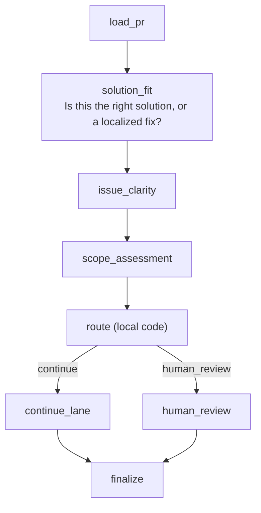

# acpxflow

`acpxflow` is a small flow runtime over `acpx`.

It is intentionally narrow:

- flows are plain JavaScript modules
- steps are either `compute(...)` or `acp(...)`
- routing happens in local code with declarative `switch` edges
- a run uses one implicit main ACP session by default
- extra sessions are explicit and optional

The included example is a maintainability-first PR triage flow for `acpx`.

## Flowchart



## Run the example

From this directory:

```bash
node src/cli.js run src/flows/pr-triage.flow.js \
  --repo openclaw/acpx \
  --pr 173 \
  --acpx /Users/onur/offline/acpx/dist/cli.js \
  --acpx-cwd /Users/onur/offline/acpx \
  --agent codex
```

The runner stores a local artifact bundle under `acpxflow/runs/<run-id>/`.

## Notes

- The prototype uses `gh` to fetch PR context.
- The prototype uses `acpx` in `--format quiet` mode and asks Codex to return one JSON object per ACP step.
- The default example sends all ACP steps through one persistent Codex session so later prompts can build on earlier context.
