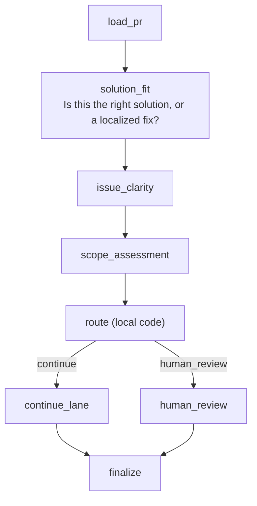

# acpxflow

`acpxflow` is a small flow runtime over `acpx`.

It is intentionally narrow:

- flows are plain JavaScript modules
- steps are either `compute(...)` or `acp(...)`
- routing happens in local code with declarative `switch` edges
- a run uses one implicit main ACP session by default
- extra sessions are explicit and optional

The repo-level `workflows/` directory contains both simple examples and the full
PR triage workflow.

## Flowchart



## Included flows

- `workflows/echo.flow.js` — one ACP step that returns JSON
- `workflows/branch.flow.js` — ACP classification followed by a local branch
- `workflows/two-turn.flow.js` — two ACP prompts in one persistent session
- `workflows/pr-triage.flow.js` — complete PR triage flow with GitHub context

## Run the examples

From the repo root:

```bash
node acpxflow/src/cli.js run workflows/echo.flow.js \
  --acpx /Users/onur/offline/acpx/dist/cli.js \
  --acpx-cwd /Users/onur/offline/acpx \
  --agent codex \
  --input-json '{"request":"Summarize this repository in one sentence."}'

node acpxflow/src/cli.js run workflows/branch.flow.js \
  --acpx /Users/onur/offline/acpx/dist/cli.js \
  --acpx-cwd /Users/onur/offline/acpx \
  --agent codex \
  --input-json '{"task":"FIX: add a regression test for the reconnect bug."}'

node acpxflow/src/cli.js run workflows/two-turn.flow.js \
  --acpx /Users/onur/offline/acpx/dist/cli.js \
  --acpx-cwd /Users/onur/offline/acpx \
  --agent codex \
  --input-json '{"topic":"How should we validate a new ACP adapter?"}'

node acpxflow/src/cli.js run workflows/pr-triage.flow.js \
  --repo openclaw/acpx \
  --pr 173 \
  --acpx /Users/onur/offline/acpx/dist/cli.js \
  --acpx-cwd /Users/onur/offline/acpx \
  --agent codex
```

The runner stores a local artifact bundle under `acpxflow/runs/<run-id>/`.

## Notes

- The prototype uses `gh` to fetch PR context.
- The prototype uses `acpx` in `--format quiet` mode and asks Codex to return one JSON object per ACP step.
- The default example sends all ACP steps through one persistent Codex session so later prompts can build on earlier context.
- The CLI accepts generic `--input-json` / `--input-file` input, and still supports `--repo` / `--pr` for the PR triage flow.
