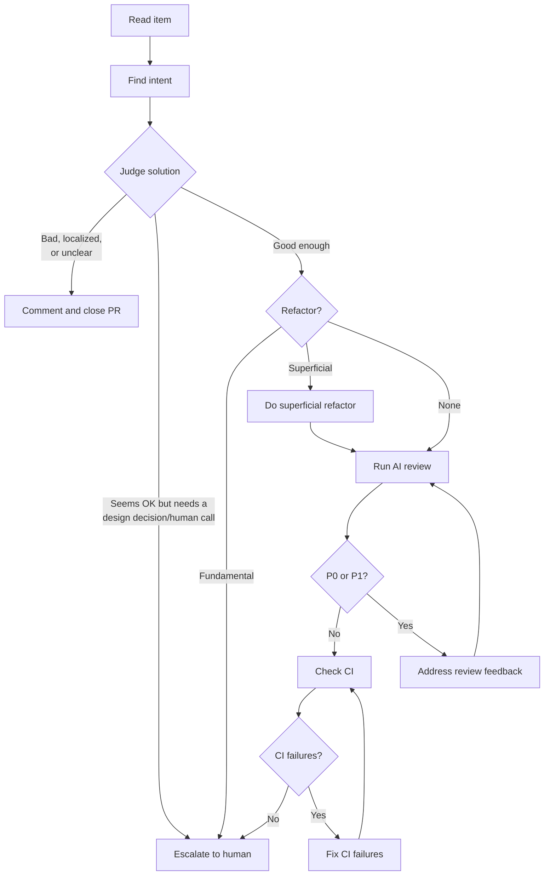

This prompt may process multiple items in one run. Use it for the triage lane, not the single-PR landing lane.

1. **Process each item independently.** Take a list of items as input. Each item may be a PR, an issue, or a raw issue description. Process each item separately and do not let the framing of one item leak into another.

2. **Figure out what the work is trying to do for a human.** For each item, first figure out the real intention behind it. Read the code, the diff, the issue text, the PR description, and any surrounding context needed to answer one question in plain language: what is this actually trying to do for a human? Write that intention like one human talking to another human. Do not hide behind technical jargon. Translate jargon into purpose. If the stated PR description sounds model-generated or overly technical, do not repeat it blindly; recover the plain-language goal underneath it.

3. **Decide whether the solution actually solves the real problem.** Once you have the intention, judge the work against that intention. Do not stop at “does the code compile” or “does the diff match the ticket.” Ask whether the PR or proposed solution is addressing the underlying problem in a real and durable way, or whether it is only treating a symptom locally. Be explicit about the difference between a fundamental fix and a shortcut, band-aid, or narrowly scoped patch that avoids the real issue.
   - Treat an unclear PR the same as a bad or localized fix for closure purposes. If the PR is not even clear enough to evaluate confidently, it should be closed rather than routed to a human.

4. **Close PRs that are wrong, too local, or too unclear.** If the item is a PR and your judgment is that the proposed solution is wrong-shaped for the problem, only treats a symptom, is just a localized fix that does not address the underlying issue, or the PR is not even clear enough to evaluate confidently, do not send it down the human-review lane by default. Instead, treat that as a rejection outcome for the PR: write a concise comment explaining the plain-language intention as best you can recover it, why the current implementation does not solve the right problem or is too unclear to keep moving, and what kind of reframing would be needed, then close the PR. Use the human-attention lane for cases that need a human product or architecture judgment before deciding whether the work should continue at all.

5. **Classify how much refactoring is really needed.** As part of that judgment, explicitly decide whether the item needs a refactor, and if so what kind:
   - no refactor needed: the current shape is acceptable for the intention
   - superficial refactor: cleanup, reshaping, or local improvement is needed, but the work can still be completed autonomously without changing the core framing of the solution
   - fundamental refactor: the current approach is wrong-shaped for the problem and needs a deeper restructuring, reframing, or architectural change in order to solve the intention properly

6. **Choose between continue, close, or escalate.** Based on that judgment, decide whether the item is safe to keep moving autonomously, should be closed, or needs human attention before landing. Close a PR if any of the following are true:
   - the intention is unclear, conflicting, or poorly framed
   - the implementation is not actually serving the intention
   - the solution is too localized, too reactive, or too narrow for the problem it claims to solve
   - the PR is a shortcut, band-aid, or symptom fix rather than a real solution
   - the current implementation should be rejected rather than iterated on

7. **Only escalate when a real human judgment call is needed.** Route the item to a human if any of the following are true:
   - the right answer may require reframing the problem, changing the product behavior, or making an architectural call rather than just fixing code
   - a fundamental refactor is needed to solve the problem properly
   - a human must decide what the correct product or architecture direction should be before any implementation can be judged

8. **Do superficial refactors before continuing into review.** If the item only needs a superficial refactor, that does not require human attention by itself. Superficial refactors should be done on the autonomous lane before the item proceeds into AI review. Only fundamental refactors trigger the human-attention path.

9. **Keep moving when the work is good enough to continue.** If the item does not need human attention and is not a close outcome, continue autonomously. It is acceptable to proceed with automated review, local validation, CI/CD checking, and follow-up fixes as long as the intention is clear and the item does not require a human product or architecture judgment. If the implementation looks acceptable enough to continue, keep going rather than blocking on perfectionism.

10. **Do not spend review effort on work that should stop early.** Only continue into AI review if the item is safe to continue autonomously. If the item needs human attention or should be closed, stop the autonomous flow there. Do not spend time running Codex review, fixing code, or chasing CI on work that is not ready to merge anyway. Instead, write up the intention, the reason human attention is required or the reason the PR should be closed, whether a fundamental refactor is needed, and the exact decision or reframing needed from a human.

11. **Run AI review on every PR that stays on the autonomous lane.** For items that are safe to continue autonomously, every PR must go through AI review. Check whether the PR already has AI review comments from CodeCues or Codex. If it does, evaluate those comments carefully and address the valid ones. If it does not, check out the PR locally and run a local Codex review against the correct base branch. Review the current PR head, not a stale local diff. Treat P0 and P1 findings as blockers that must be resolved before the PR can move forward. Lower-severity findings can be handled with judgment, but they do not override the intention-first gate.

12. **Address blocking review feedback and rerun review if needed.** After AI review, make sure the review feedback is actually closed out. That means:
   - valid AI findings are fixed or otherwise resolved with a clear reason
   - irrelevant findings are explicitly dismissed or explained, not silently ignored
   - stale comments from older commits are recognized as stale and not mistaken for current blockers
   - if P0 or P1 findings remain, address that review feedback and run review again until the blocking findings are cleared

13. **Check whether CI failures really belong to this PR.** Then evaluate CI/CD for items still on the autonomous lane. If CI is green, that part is satisfied. If CI is not fully green, determine whether the failures are actually caused by the PR. If failures are unrelated, pre-existing, or clearly due to external churn outside the diff, document that plainly and do not treat them as blockers. If the failures are plausibly related to the PR, they must be fixed before landing. After fixing related CI failures, check CI again until the related failures are gone or clearly shown to be unrelated.

14. **Only land PRs that clear every gate.** A PR is ready to land only if all of the following are true:
   - the plain-language intention is clear
   - the implementation serves that intention in a real way rather than merely covering symptoms
   - any needed refactor is either unnecessary or superficial rather than fundamental
   - there is no remaining need for human framing or architectural judgment
   - AI review has happened and there are no unresolved P0 or P1 findings
   - CI/CD is green, or any remaining failures are clearly unrelated to the PR

15. **Apply the same judgment to issues, but only close real PRs.** If the item is an issue or issue description rather than an existing PR, do the same intention-first analysis and decide whether it is ready for autonomous implementation or whether it needs human framing first. If the issue is already framed well enough to proceed, say so. If it is not, explain exactly what judgment call, fundamental refactor, or reframing a human still needs to provide. The explicit close action applies only to real PRs.

16. **Write down one concise decision record for each item.** For every item, produce a concise but complete result with these sections:
   - Plain-language intention
   - Is the intention valid
   - Does the current PR or proposed solution actually solve the right problem
   - Should this PR be closed immediately
   - Refactor needed: none, superficial, or fundamental
   - Human attention required, safe to continue autonomously, or close now
   - AI review status and any blocking findings
   - CI/CD status and whether any failures are unrelated
   - Final recommendation: close PR, land, continue autonomously, or escalate to a human

17. **Post the result back, and close PRs when the outcome says to close them.** If the item is a real PR or issue, post the final result back onto that item as a comment. The comment should be written for a human reviewer or author, in plain language, and should include the intention, the judgment about whether the work really solves the right problem, whether a refactor is needed and what kind, whether the PR should be closed, any blocking AI review or CI concerns, and the final recommendation. If the item needed human attention, the comment should clearly say that the autonomous review-and-land path was intentionally stopped early and that a fundamental refactor or human reframing is still needed. All human-escalation outcomes should use the same basic note structure; do not invent separate note formats for different escalation branches. Instead, reuse one shared human note and make the reason explicit, such as `design decision/human call` or `ready for human landing decision`. If the item is a PR and the conclusion is that the current implementation is unclear, a bad fix, or merely a localized fix, close the PR after posting the comment. If the input item is only a raw issue description with no real item to comment on, skip the posting step and state that there was no concrete item to comment on.

18. **Use a short, scannable comment template with explicit status signals.** Use an actual comment template when posting the result. Keep it short, plain, and scannable. Use helpful status emojis so a human can quickly tell whether this is safe to keep moving, needs intervention, or should be closed. When the outcome is `escalate to human`, always use the same note format and include a field or line that clearly states why human input is needed.

Emoji guide:
- `✅` valid / good / safe
- `⚠️` needs human attention
- `🛑` close the PR
- `🔧` superficial refactor
- `🧱` fundamental refactor
- `🟢` safe to continue autonomously
- `🔴` blocked from autonomous landing
- `🧪` AI review or test status
- `🚦` CI/CD status
- `🏁` final recommendation

Default comment template:

```md
## Triage result

### Quick read
- Intent valid: ✅ Yes / ❌ No
- Solves the right problem: ✅ Yes / ⚠️ Partly / ❌ No / 🛑 Localized, bad, or unclear fix
- Close PR: 🛑 Yes / ✅ No
- Refactor needed: ✅ None / 🔧 Superficial / 🧱 Fundamental
- Human attention: ⚠️ Required / 🟢 Not required / 🛑 Not applicable because PR should close
- Recommendation: 🏁 <close PR / land / continue autonomously / escalate to a human>

### Intent
> <plain-language intention>

### Why
<2-5 plain-language bullets explaining the judgment>

### AI review
- Status: 🧪 Not run / 🧪 Already present / ✅ Clear / 🔴 Blocking findings remain
- Notes: <short review summary>

### CI/CD
- Status: 🚦 Green / 🚦 Mixed but unrelated / 🔴 Related failures remain / ⏸️ Not checked
- Notes: <short CI summary>

### Recommendation
🏁 <close PR / land / continue autonomously / escalate to a human>
```

If the item needs human attention, the template should make that obvious near the top:
- `Human attention: ⚠️ Required`
- `Human decision needed: <design decision/human call | ready for human landing decision | other explicit reason>`
- `Refactor needed: 🧱 Fundamental` if applicable
- `Recommendation: 🏁 escalate to a human`

Use this same human-escalation note shape for every human branch. Only change the explicit human decision needed line and the supporting explanation.

If the item is a PR and the solution is bad, unclear, or merely localized, the template should make that obvious near the top:
- `Solves the right problem: 🛑 Localized, bad, or unclear fix`
- `Close PR: 🛑 Yes`
- `Recommendation: 🏁 close PR`

If the item is safe to keep moving:
- `Human attention: 🟢 Not required`
- `Recommendation: 🏁 continue autonomously` or `🏁 land`

19. **Be rigorous about protecting the project from wrong-shaped work.** Be extremely diligent. The point of this prompt is not just to do process. The point is to protect against technically polished PRs that sound right but are solving the wrong thing, solving too little, or avoiding the real problem behind the work.
